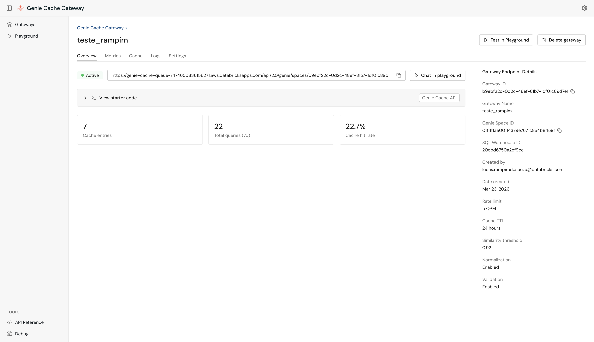
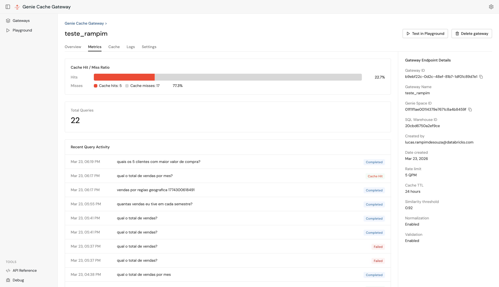
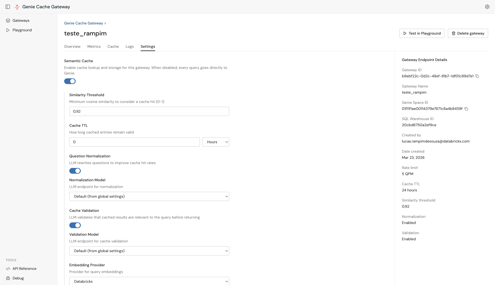

# Genie Gateway (Cache & Queue)

Drop-in replacement for the Databricks Genie API with semantic caching, rate-limit management, and multi-gateway support. Deploy as a Databricks App — callers only change the base URL, zero code changes required.

The Genie API has a hard limit of **5 queries per minute per workspace**. This app sits in front of it:

- **Cache hit** — Re-executes the cached SQL against the warehouse (fresh data, no Genie call)
- **Cache miss** — Calls Genie in the background, queues if rate-limited, retries with exponential backoff
- **Rate limit** — Manages the 5 QPM limit transparently with a queue and backoff

Each **gateway** is a named configuration that maps to one Genie Space and SQL Warehouse. Gateways have independent caches, queues, and settings.

## Architecture

```
Caller (OAuth)
    |
    v
App (/api/2.0/genie/* or /api/v1/ or /api/gateways/)
    |
    +-- Gateway Config (DB)         <-- name, space_id, warehouse_id, settings
    +-- Embedding Service           <-- caller's OAuth (semantic similarity)
    +-- Cache (Lakebase/PGVector)   <-- app SP OAuth, scoped per gateway
    +-- Genie API                   <-- caller's OAuth (on cache miss only)
    +-- SQL Warehouse               <-- caller's OAuth (re-execute cached SQL)
```

## Quick Start

### Prerequisites

- Databricks workspace with **Apps** enabled
- [Databricks CLI](https://docs.databricks.com/dev-tools/cli/install.html) installed and configured
- A **Genie Space** and **SQL Warehouse** in your workspace
- *(Optional)* A **Lakebase** instance for persistent cache

### 1. Deploy the App

```bash
# Sync code to your workspace
databricks sync . /Workspace/Users/<your-email>/genie-cache-queue

# Deploy
databricks apps deploy genie-cache-queue \
  --source-code-path /Workspace/Users/<your-email>/genie-cache-queue
```

### 2. Create a Gateway

Open the app URL. On the **Gateways** home page, click **+** to create a new gateway:


| Field | Description |
|-------|-------------|
| **Name** | Display name for this gateway (e.g. `Retail Analytics`) |
| **Genie Space** | Select from spaces auto-discovered in your workspace |
| **SQL Warehouse** | Select from available warehouses |
| **Advanced** | Similarity threshold, cache TTL, rate limit, normalization/validation |

### 3. Use the Endpoint

From the gateway's **Overview** tab, copy the ready-to-use endpoint URL:



Change the base URL in your application — everything else stays the same:

```python
# Before (direct Genie — hits 5 QPM limit)
BASE = "https://<workspace>.cloud.databricks.com"

# After (with cache + retry — same endpoints, same auth)
BASE = "https://<app-name>.aws.databricksapps.com"

# Use gateway ID instead of space ID
r = requests.post(f"{BASE}/api/2.0/genie/spaces/{GATEWAY_ID}/start-conversation",
    headers={"Authorization": f"Bearer {TOKEN}"},
    json={"content": "How many customers?"})
```

---

## Playground

Use the built-in **Playground** to test queries interactively. The pipeline visualizer shows each step in real time.

**Cache Miss** — first time a question is asked, it goes through Genie:


**Cache Hit** — same question again, Genie is bypassed entirely:


---

## Gateway Management

Each gateway has a detail page with five tabs.

**Metrics** — cache hit rate, total queries (7-day window), and cache entry count:



**Cache** — all cached queries with SQL, usage count, and freshness:


**Logs** — full query history scoped to this gateway with status and cache hit/miss badge:


**Settings** — per-gateway overrides for threshold, TTL, rate limit, normalization, and validation:



### Gateway Configuration Reference

| Field | Description | Default |
|-------|-------------|---------|
| `name` | Unique display name | Required |
| `genie_space_id` | Databricks Genie Space ID | Required |
| `sql_warehouse_id` | SQL Warehouse for query execution | Required |
| `similarity_threshold` | Cache match threshold (0–1) | 0.92 |
| `cache_ttl_hours` | Cache freshness in hours (0 = unlimited) | 24 |
| `max_queries_per_minute` | Rate limit per workspace | 5 |
| `question_normalization_enabled` | Normalize questions before embedding | true |
| `cache_validation_enabled` | Validate cache hits with LLM | true |
| `embedding_provider` | `databricks` or custom endpoint | `databricks` |
| `shared_cache` | Share cache across all users | true |

---

## Global Settings

Configure once in the **Settings** page. These apply as defaults for all gateways:


| Field | Description |
|-------|-------------|
| **Lakebase Instance Name** | Autoscaling project name or direct hostname |
| **Lakebase Catalog / Schema** | Usually `default` / `public` |
| **Lakebase Service Token** | The app's built-in SP handles authentication automatically — only set this to override |
| **Embedding Provider** | `databricks` (Foundation Model API) or `local` |
| **Question Normalization** | LLM rewrites questions before embedding to improve cache hit rate |
| **Cache Validation** | LLM validates cached results are relevant before returning them |

---

## Lakebase Setup (Persistent Cache)

For production use, Lakebase provides persistent vector-based caching with pgvector. Inside Databricks Apps, the app automatically uses its **built-in Service Principal** — no manual credential configuration required.

### 1. Grant the App's SP Access to Lakebase

Find the app's SP name in **Workspace Settings > Compute > Apps > your app > Service Principal**, then grant it CAN_MANAGE:

```python
from databricks.sdk import WorkspaceClient
from databricks.sdk.service.iam import AccessControlRequest, PermissionLevel

w = WorkspaceClient()
w.permissions.update('database-projects', '<project-name>',
    access_control_list=[
        AccessControlRequest(
            service_principal_name='<app-sp-display-name>',
            permission_level=PermissionLevel.CAN_MANAGE
        )
    ])
```

### 2. Create the SP's PostgreSQL Role

Connect to Lakebase as a human user and run (replace `<app-sp-client-id>` with the app's SP client ID):

```sql
CREATE EXTENSION IF NOT EXISTS databricks_auth;
SELECT databricks_create_role('<app-sp-client-id>', 'SERVICE_PRINCIPAL');

GRANT ALL ON SCHEMA public TO "<app-sp-client-id>";
GRANT ALL ON ALL TABLES IN SCHEMA public TO "<app-sp-client-id>";
ALTER DEFAULT PRIVILEGES IN SCHEMA public GRANT ALL ON TABLES TO "<app-sp-client-id>";
```

> **Important:**
> - Use `databricks_create_role()` — not `CREATE ROLE`. Only `databricks_create_role` enables OAuth JWT authentication. See: [Create Postgres roles](https://docs.databricks.com/aws/en/oltp/projects/postgres-roles)
> - **Do not create the cache tables manually.** Let the app create them on first use. If tables were already created by a different user, drop them first so the app's SP recreates them as owner.

### 3. Configure in Settings

Set **Storage Backend** to `Lakebase` and fill in the **Instance Name**. The app creates the required tables (cache, query_logs, gateways) automatically on first use.

### Local Development

For local development (outside Databricks Apps), configure the **Lakebase Service Token** in Settings or `.env`:
- **Service Principal:** `<client_id>:<client_secret>` (recommended)
- **PAT:** `dapi...` (simpler, for development)

---

## Authentication

| Component | Token | Source |
|-----------|-------|--------|
| Genie API | Caller's OAuth | `X-Forwarded-Access-Token` (browser) or `Authorization: Bearer` (API) |
| SQL Warehouse | Caller's OAuth | Same |
| Embeddings | Caller's OAuth | Same |
| **Lakebase cache** | **App's built-in SP** | Auto-detected from `DATABRICKS_CLIENT_ID`/`SECRET` |

**Callers don't need Lakebase access.** The app's SP handles all cache operations transparently.

---

## API Reference

Three API families are available. Full documentation is built into the app:


### Clone API (Drop-in Replacement)

All endpoints mirror the official [Databricks Genie API](https://docs.databricks.com/api/workspace/genie). Use the **gateway ID** where you would normally use the Genie Space ID:

| Method | Path | Description |
|--------|------|-------------|
| POST | `/api/2.0/genie/spaces/{gateway_id}/start-conversation` | Start conversation (cache + queue) |
| POST | `.../conversations/{cid}/messages` | Follow-up message |
| GET | `.../conversations/{cid}/messages/{mid}` | Poll for result |
| GET | `.../messages/{mid}/attachments/{aid}/query-result` | Get query data |
| POST | `.../messages/{mid}/attachments/{aid}/execute-query` | Re-execute query |
| GET | `/api/2.0/genie/spaces/{gateway_id}` | Space metadata (proxied) |

### Proxy API (REST)

Simplified REST API for external applications:

| Method | Path | Description |
|--------|------|-------------|
| POST | `/api/v1/query` | Submit query (async) |
| GET | `/api/v1/query/{id}` | Poll query status |
| POST | `/api/v1/query/sync` | Submit and wait (up to 120s) |
| GET | `/api/v1/health` | Health check |
| GET | `/api/v1/cache` | List cached queries |
| GET | `/api/v1/queue` | List queued queries |
| GET | `/api/v1/query-logs` | Recent query logs |

### Gateway Management API

| Method | Path | Description |
|--------|------|-------------|
| GET | `/api/gateways` | List all gateways (with stats) |
| POST | `/api/gateways` | Create a new gateway |
| GET | `/api/gateways/{id}` | Get gateway details |
| PUT | `/api/gateways/{id}` | Update gateway settings |
| DELETE | `/api/gateways/{id}` | Delete a gateway |
| GET | `/api/gateways/{id}/metrics` | Cache hit rate, total queries, cache entries |
| GET | `/api/gateways/{id}/cache` | List cached queries for this gateway |
| DELETE | `/api/gateways/{id}/cache` | Clear cache for this gateway |
| GET | `/api/gateways/{id}/logs` | Query logs scoped to this gateway |
| GET | `/api/workspace/genie-spaces` | List available Genie Spaces |
| GET | `/api/workspace/warehouses` | List available SQL warehouses |
| GET | `/api/workspace/serving-endpoints` | List available LLM serving endpoints |
| GET | `/api/settings` | Get global settings |
| PUT | `/api/settings` | Update global settings |
| POST | `/api/settings/test-connection` | Test Lakebase connection |

---

## Local Development

```bash
# Backend
cd backend
cp .env.example .env              # Edit with your DATABRICKS_TOKEN, etc.
pip install -r ../requirements.txt
python -m uvicorn app.main:app --reload --port 8000

# Frontend (separate terminal)
cd frontend
npm install
npm run dev                        # http://localhost:5173
```

## Demo Notebook

The included `demo_notebook.ipynb` fires 7 queries in parallel to demonstrate:
1. **Direct to Genie** — queries get blocked with 429 errors
2. **Via the App (first run)** — all queries complete, queue manages rate limits
3. **Via the App (second run)** — all queries served from cache instantly

Before running, upload `.env.example` to your Workspace home and fill in your values:

```bash
databricks workspace import /Workspace/Users/<your-email>/.env \
  --file .env.example --format RAW --profile <profile>
```

The notebook auto-detects your username and loads the `.env` from there.

## Continuous Deployment

```bash
# After code changes
databricks sync . /Workspace/Users/<your-email>/genie-cache-queue
databricks apps deploy genie-cache-queue \
  --source-code-path /Workspace/Users/<your-email>/genie-cache-queue

# View logs
databricks apps logs genie-cache-queue --follow
```

## Credits

This project is based on [genie-lakebase-cache](https://github.com/databricks-field-eng/genie-lakebase-cache) by Sean Kim.
